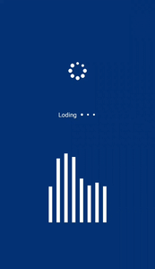

# React Native Indicator Kit 

React Native Indicator Kit :fire: :rocket: :star2:

 

[](https://www.npmjs.com/package/react-native-indicator-kit/)





## Getting Started
```
npm i react-native-indicator-kit --save
```
or
```
yarn add react-native-indicator-kit
```

## Latest Release Version 
## ```v1.0.0``` 


## CircularLoader
The `CircularLoader` component displays a circular animated loader with dots that expand and contract in a rhythmic sequence. It is customizable via props such as `size`, `color`, `number of dots`, and `dot size`.

## Usage

```javascript
import { CircularLoader } from 'react-native-indicator-kit';

const App = () => {
    return (
        <CircularLoader
            size={30}      // Diameter of the loader
            color="blue"   // Color of the dots
            dotCount={8}  // Number of dots in the loader
            dotSize={6}    // Diameter of each dot
        />
    );
};
```


## Props
| Prop                  | Type | Description | Required | Default |
| ----------------------- | --- | ------- | --- | ------------------------------------------------------------------------------------------------------------------------------------------------------------------------------- |
| size              | number  | Diameter of the loader container     | No  | 30 |
| color              | string  | Color of the dots     | No  | 'white' |
| dotCount              | number  | Number of dots in the circular animation     | No  | 8 |
| dotSize              | number  | Diameter of each dot     | No  | 6 |


---


## TextLoader
The `TextLoader` component is an animated loader that displays a customizable number of dots scaling in a `wave-like effect`. Optionally, a content text can be displayed alongside the dots.


## Usage

```javascript
import { TextLoader } from 'react-native-indicator-kit';

const App = () => {
    return (
        <TextLoader
            dotSize={4}              // Diameter of each dot
            color="blue"             // Color of the dots
            dotCount={3}             // Number of dots in the animation
            content="Loading"        // Text to display before the dots
            contentStyle={{ color: 'blue', fontWeight: 'bold' }} // Style for the content text
        />
    );
};

```


## Props
| Prop                  | Type | Description | Required | Default |
| ----------------------- | --- | ------- | --- | ------------------------------------------------------------------------------------------------------------------------------------------------------------------------------- |
| dotSize              | number  | Diameter of each animated dot     | No  | 4 |
| color              | string  | Color of the dots     | No  | 'white' |
| dotCount              | string  | Number of animated dots in the loader     | No  | 3 |
| content              | number  | Text to display before the animated dots     | No  | '' (empty) |
| contentStyle              | object  | Style object to customize the appearance of content     | No  | {} |


---


## EqualizerBarLoader
The `EqualizerBarLoader` component displays an animated equalizer loader with bars that pulsate vertically, creating an effect similar to a music equalizer. It's customizable with several props.


## Usage

```javascript
import { EqualizerBarLoader } from 'react-native-indicator-kit';

const App = () => {
    return (
        <EqualizerBarLoader
            barCount={6}        // Number of bars in the equalizer
            size={80}           // Size of the loader
            color="green"      // Color of the bars
            barStyle={{ marginHorizontal: 8, }} // Custom style for each bar
        />
    );
};

```


## Props
| Prop                  | Type | Description | Required | Default |
| ----------------------- | --- | ------- | --- | ------------------------------------------------------------------------------------------------------------------------------------------------------------------------------- |
| barCount              | number  | Number of bars in the loader animation     | No  | 8 |
| size              | number  | Size of the equalizer loader     | No  | 60 |
| color              | string  | Color of the bars     | No  | 'white' |
| barStyle              | object  | Custom styles for each individual bar     | No  | {} |


## Author
[almdashif](https://github.com/almdashif)

## License
[MIT Licensed](https://github.com/almdashif/react-native-indicator-kit/blob/main/LICENSE)


